**Documentation fonctionnelle**
# CTI Intelligence V0 - Documentation Fonctionnelle Organisée

## 📑 Table des Matières

1. [🎯 Vue d'Ensemble du Projet](#vue-densemble)
2. [🔐 Module 1 : Authentification](#module-authentification)
3. [🏠 Module 2 : Dashboard Principal](#module-dashboard)
4. [🛡️ Module 3 : Sources CTI](#module-sources-cti)
5. [👥 Module 4 : Gestion Utilisateurs](#module-gestion-utilisateurs)
6. [🔍 Module 5 : Investigation RAG](#module-investigation-rag)
7. [🔄 Fonctionnalités Transversales](#fonctionnalites-transversales)
8. [📊 Critères de Validation](#criteres-validation)

---

## 🎯 Vue d'Ensemble du Projet {#vue-densemble}

### **Objectif Principal V0**
Développer une application web responsive CTI permettant aux analystes SOC de centraliser, analyser et investiguer les alertes de sécurité provenant de trois sources principales : Wazuh SIEM, OpenVAS Scanner et OTX AlienVault, avec enrichissement automatique via Azure OpenAI.

### **Périmètre Fonctionnel V0**
- **5 Modules** : Authentification, Dashboard, Sources CTI, Gestion Utilisateurs, Investigation RAG
- **Technologies Clés** : API RAG Azure OpenAI, Mapping MITRE ATT&CK, Génération Kestrel
- **Architecture** : Application web responsive avec modal investigation (pas d'interface dédiée)

---

## 🔐 Module 1 : Authentification et Contrôle d'Accès {#module-authentification}

### **Scénario 1.1 : Connexion Utilisateur Standard**

**Objectif :** Permettre l'accès sécurisé à l'application selon le rôle utilisateur

**Description :**
L'utilisateur accède à l'URL de l'application et saisit ses identifiants (email + mot de passe). Le système valide les informations, génère un token JWT sécurisé de 8 heures, et redirige vers le dashboard approprié selon le rôle (Admin/Analyst/Viewer).

**Résultat Attendu :** Accès personnalisé avec session sécurisée de 8 heures maximum

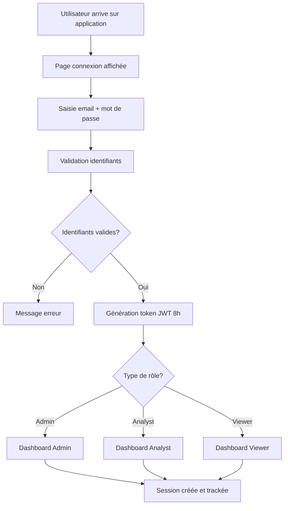
```mermaid
graph TD
    A[Utilisateur arrive sur application] --> B[Page connexion affichée]
    B --> C[Saisie email + mot de passe]
    C --> D[Validation identifiants]
    D --> E{Identifiants valides?}
    E -->|Non| F[Message erreur]
    E -->|Oui| G[Génération token JWT 8h]
    G --> H{Type de rôle?}
    H -->|Admin| I[Dashboard Admin]
    H -->|Analyst| J[Dashboard Analyst] 
    H -->|Viewer| K[Dashboard Viewer]
    I --> L[Session créée et trackée]
    J --> L
    K --> L
```

### **Scénario 1.2 : Protection Anti-Bruteforce**

**Objectif :** Sécuriser l'application contre les attaques par force brute

**Description :**
Le système surveille les échecs de connexion. Après 3 tentatives échouées consécutives, le compte est bloqué 15 minutes. Toutes les tentatives sont tracées dans les logs de sécurité avec IP source et horodatage.

**Résultat Attendu :** Protection efficace avec possibilité de récupération légitime

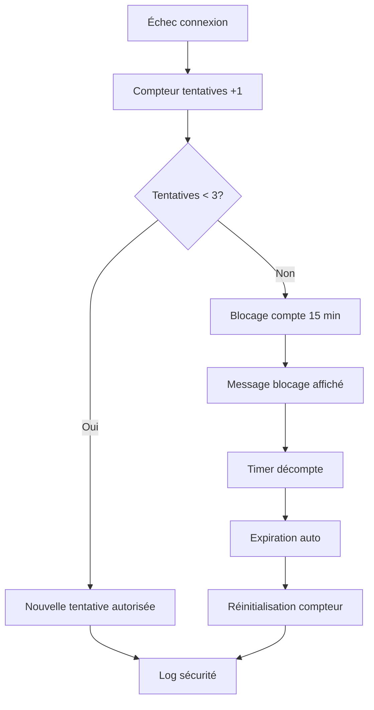
```mermaid
graph TD
    A[Échec connexion] --> B[Compteur tentatives +1]
    B --> C{Tentatives < 3?}
    C -->|Oui| D[Nouvelle tentative autorisée]
    C -->|Non| E[Blocage compte 15 min]
    E --> F[Message blocage affiché]
    F --> G[Timer décompte]
    G --> H[Expiration auto]
    H --> I[Réinitialisation compteur]
    D --> J[Log sécurité]
    I --> J
```

### **Scénario 1.3 : Gestion Rôles et Permissions**

**Objectif :** Attribuer les droits d'accès selon le profil utilisateur

**Description :**
Après authentification réussie, le système charge les permissions associées au rôle utilisateur. L'interface est dynamiquement adaptée en masquant les fonctionnalités inaccessibles.

**Rôles Disponibles :**
- **Admin** : Accès complet + gestion utilisateurs + configuration
- **Analyst** : Alertes assignées + investigation + hunt
- **Viewer** : Lecture seule dashboard + consultation profil

**Résultat Attendu :** Interface personnalisée strictement limitée aux droits du rôle

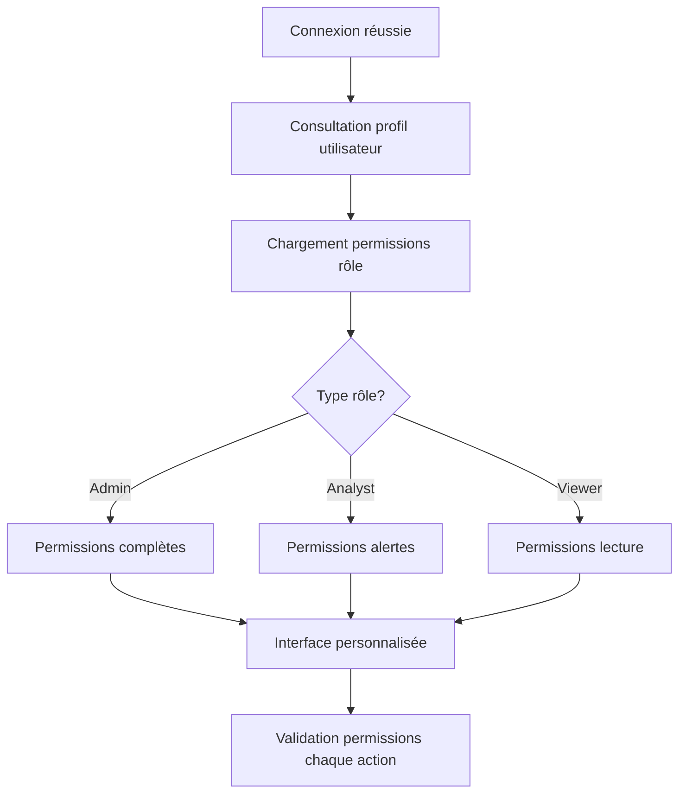
```mermaid
graph TD
    A[Connexion réussie] --> B[Consultation profil utilisateur]
    B --> C[Chargement permissions rôle]
    C --> D{Type rôle?}
    D -->|Admin| E[Permissions complètes]
    D -->|Analyst| F[Permissions alertes]
    D -->|Viewer| G[Permissions lecture]
    E --> H[Interface personnalisée]
    F --> H
    G --> H
    H --> I[Validation permissions chaque action]
```

---

## 🏠 Module 2 : Dashboard Principal et Visualisation {#module-dashboard}

### **Scénario 2.1 : Chargement Initial Dashboard**

**Objectif :** Afficher une vue d'ensemble de la sécurité en moins de 2 secondes

**Description :**
Le dashboard initialise une connexion WebSocket pour le temps réel, charge les données 24h en priorité, calcule les métriques 30 jours en arrière-plan. Affichage : alertes actives, statistiques, historique paginé, statut sources CTI.

**Résultat Attendu :** Vue complète situation sécurité < 2 secondes avec temps réel actif

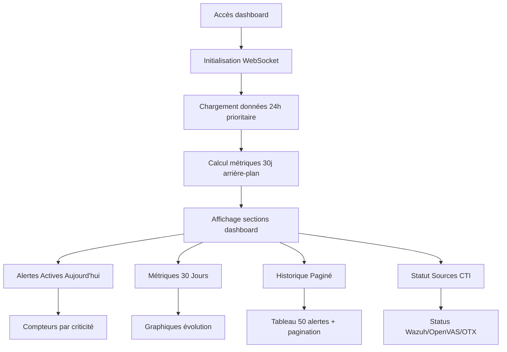
```mermaid
graph TD
    A[Accès dashboard] --> B[Initialisation WebSocket]
    B --> C[Chargement données 24h prioritaire]
    C --> D[Calcul métriques 30j arrière-plan]
    D --> E[Affichage sections dashboard]
    E --> F[Alertes Actives Aujourd'hui]
    E --> G[Métriques 30 Jours]
    E --> H[Historique Paginé]
    E --> I[Statut Sources CTI]
    F --> J[Compteurs par criticité]
    G --> K[Graphiques évolution]
    H --> L[Tableau 50 alertes + pagination]
    I --> M[Status Wazuh/OpenVAS/OTX]
```

### **Scénario 2.2 : Alertes Temps Réel**

**Objectif :** Notification immédiate des nouvelles menaces

**Description :**
Nouvelle alerte détectée → normalisation + scoring → diffusion WebSocket → mise à jour automatique dashboard sans refresh. Alertes critiques (score > 8) mises en évidence visuellement.

**Résultat Attendu :** Notification instantanée avec mise à jour automatique toutes métriques

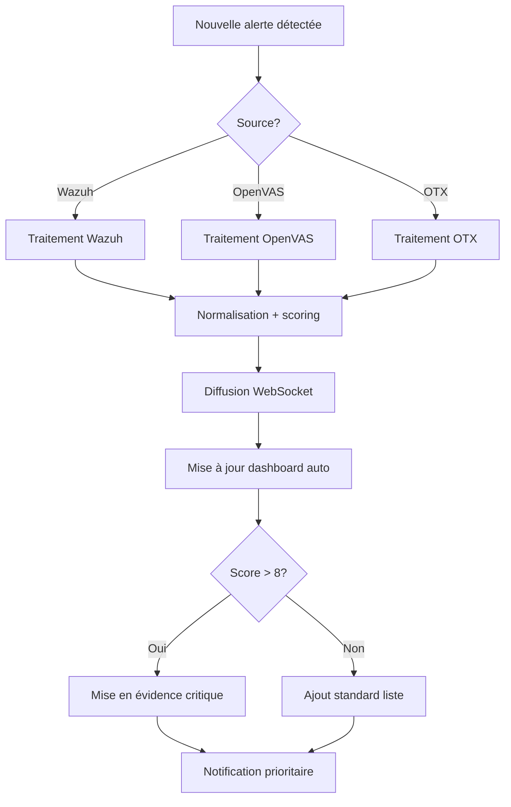
```mermaid
graph TD
    A[Nouvelle alerte détectée] --> B{Source?}
    B -->|Wazuh| C[Traitement Wazuh]
    B -->|OpenVAS| D[Traitement OpenVAS]
    B -->|OTX| E[Traitement OTX]
    C --> F[Normalisation + scoring]
    D --> F
    E --> F
    F --> G[Diffusion WebSocket]
    G --> H[Mise à jour dashboard auto]
    H --> I{Score > 8?}
    I -->|Oui| J[Mise en évidence critique]
    I -->|Non| K[Ajout standard liste]
    J --> L[Notification prioritaire]
    K --> L
```

### **Scénario 2.3 : Navigation Historique Paginée**

**Objectif :** Consultation efficace historique 30 jours avec filtrage avancé

**Description :**
Affichage tableau 50 alertes par page avec filtres multiples (date, source, criticité, recherche textuelle). Navigation pagination avec requêtes optimisées LIMIT/OFFSET. Export CSV possible avec métadonnées audit.

**Résultat Attendu :** Navigation fluide < 500ms avec filtrage dynamique et export

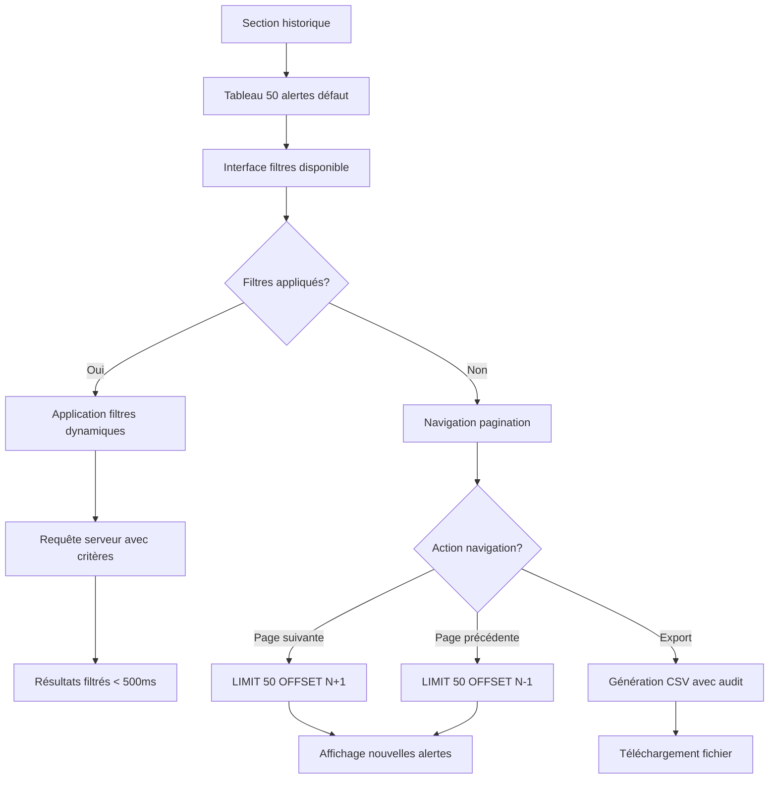
```mermaid
graph TD
    A[Section historique] --> B[Tableau 50 alertes défaut]
    B --> C[Interface filtres disponible]
    C --> D{Filtres appliqués?}
    D -->|Oui| E[Application filtres dynamiques]
    D -->|Non| F[Navigation pagination]
    E --> G[Requête serveur avec critères]
    G --> H[Résultats filtrés < 500ms]
    F --> I{Action navigation?}
    I -->|Page suivante| J[LIMIT 50 OFFSET N+1]
    I -->|Page précédente| K[LIMIT 50 OFFSET N-1]
    I -->|Export| L[Génération CSV avec audit]
    J --> M[Affichage nouvelles alertes]
    K --> M
    L --> N[Téléchargement fichier]
```

### **Scénario 2.4 : Métriques et Tendances**

**Objectif :** Vision stratégique évolution paysage menaces

**Description :**
Section métriques 30 jours avec graphiques interactifs : évolution quotidienne, répartition sources, top hosts impactés, CVEs critiques. Calculs automatiques tendances et patterns émergents.

**Résultat Attendu :** Identification patterns d'attaque avec drill-down détaillé

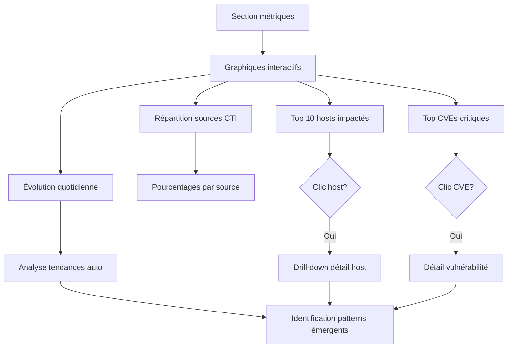
```mermaid
graph TD
    A[Section métriques] --> B[Graphiques interactifs]
    B --> C[Évolution quotidienne]
    B --> D[Répartition sources CTI]
    B --> E[Top 10 hosts impactés]
    B --> F[Top CVEs critiques]
    C --> G[Analyse tendances auto]
    D --> H[Pourcentages par source]
    E --> I{Clic host?}
    F --> J{Clic CVE?}
    I -->|Oui| K[Drill-down détail host]
    J -->|Oui| L[Détail vulnérabilité]
    G --> M[Identification patterns émergents]
    K --> M
    L --> M
```

---

## 🛡️ Module 3 : Intégration Sources CTI {#module-sources-cti}

### **Scénario 3.1 : Synchronisation Wazuh SIEM**

**Objectif :** Collecte automatique alertes Wazuh avec mapping MITRE ATT&CK

**Description :**
Scheduler 15 minutes → connexion API REST Wazuh → authentification → récupération nouvelles alertes → normalisation criticité (0-15 vers 0-10) → mapping automatique techniques MITRE → stockage + diffusion WebSocket.

**Résultat Attendu :** Intégration transparente avec enrichissement MITRE automatique

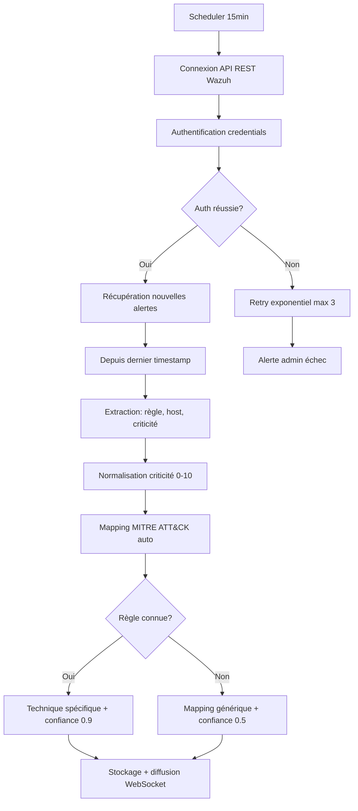
```mermaid
graph TD
    A[Scheduler 15min] --> B[Connexion API REST Wazuh]
    B --> C[Authentification credentials]
    C --> D{Auth réussie?}
    D -->|Non| E[Retry exponentiel max 3]
    D -->|Oui| F[Récupération nouvelles alertes]
    F --> G[Depuis dernier timestamp]
    G --> H[Extraction: règle, host, criticité]
    H --> I[Normalisation criticité 0-10]
    I --> J[Mapping MITRE ATT&CK auto]
    J --> K{Règle connue?}
    K -->|Oui| L[Technique spécifique + confiance 0.9]
    K -->|Non| M[Mapping générique + confiance 0.5]
    L --> N[Stockage + diffusion WebSocket]
    M --> N
    E --> O[Alerte admin échec]
```

### **Scénario 3.2 : Import OpenVAS Scanner**

**Objectif :** Identification proactive vulnérabilités exploitables

**Description :**
Connexion GMP OpenVAS → recherche nouveaux rapports → parsing XML → extraction CVE/CVSS → filtrage CVSS > 4.0 → mapping techniques exploitation MITRE → génération alertes selon criticité.

**Résultat Attendu :** Priorisation automatique vulnérabilités avec techniques d'exploitation

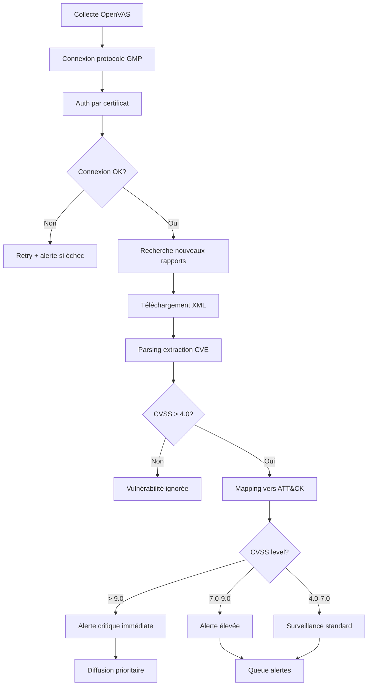
```mermaid
graph TD
    A[Collecte OpenVAS] --> B[Connexion protocole GMP]
    B --> C[Auth par certificat]
    C --> D{Connexion OK?}
    D -->|Non| E[Retry + alerte si échec]
    D -->|Oui| F[Recherche nouveaux rapports]
    F --> G[Téléchargement XML]
    G --> H[Parsing extraction CVE]
    H --> I{CVSS > 4.0?}
    I -->|Non| J[Vulnérabilité ignorée]
    I -->|Oui| K[Mapping vers ATT&CK]
    K --> L{CVSS level?}
    L -->|> 9.0| M[Alerte critique immédiate]
    L -->|7.0-9.0| N[Alerte élevée]
    L -->|4.0-7.0| O[Surveillance standard]
    M --> P[Diffusion prioritaire]
    N --> Q[Queue alertes]
    O --> Q
```

### **Scénario 3.3 : Ingestion OTX Threat Intelligence**

**Objectif :** Détection précoce menaces via intelligence globale

**Description :**
API OTX AlienVault + respect rate limits → récupération pulses → filtrage confiance ≥ 3 + TLP:WHITE → extraction IOCs (domaines, IPs, hashes) → enrichissement géo/ASN → croisement logs internes → génération alertes si correspondance.

**Résultat Attendu :** Identification compromissions existantes via IOCs externes

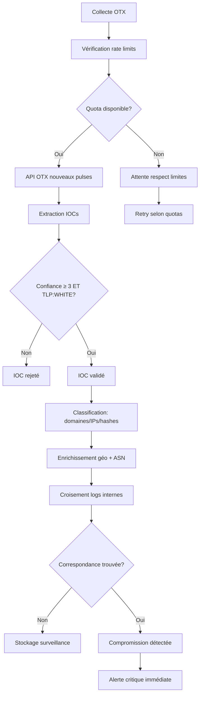
```mermaid
graph TD
    A[Collecte OTX] --> B[Vérification rate limits]
    B --> C{Quota disponible?}
    C -->|Non| D[Attente respect limites]
    C -->|Oui| E[API OTX nouveaux pulses]
    E --> F[Extraction IOCs]
    F --> G{Confiance ≥ 3 ET TLP:WHITE?}
    G -->|Non| H[IOC rejeté]
    G -->|Oui| I[IOC validé]
    I --> J[Classification: domaines/IPs/hashes]
    J --> K[Enrichissement géo + ASN]
    K --> L[Croisement logs internes]
    L --> M{Correspondance trouvée?}
    M -->|Non| N[Stockage surveillance]
    M -->|Oui| O[Compromission détectée]
    O --> P[Alerte critique immédiate]
    D --> Q[Retry selon quotas]
```

### **Scénario 3.4 : Normalisation Données Tri-Sources**

**Objectif :** Harmonisation formats hétérogènes vers modèle unifié

**Description :**
Réception données Wazuh/OpenVAS/OTX → application règles normalisation → mapping criticités vers échelle 0-10 → extraction métadonnées communes → agrégation techniques MITRE → génération UUID unique → format unifié final.

**Résultat Attendu :** Vision cohérente menaces indépendamment source origine

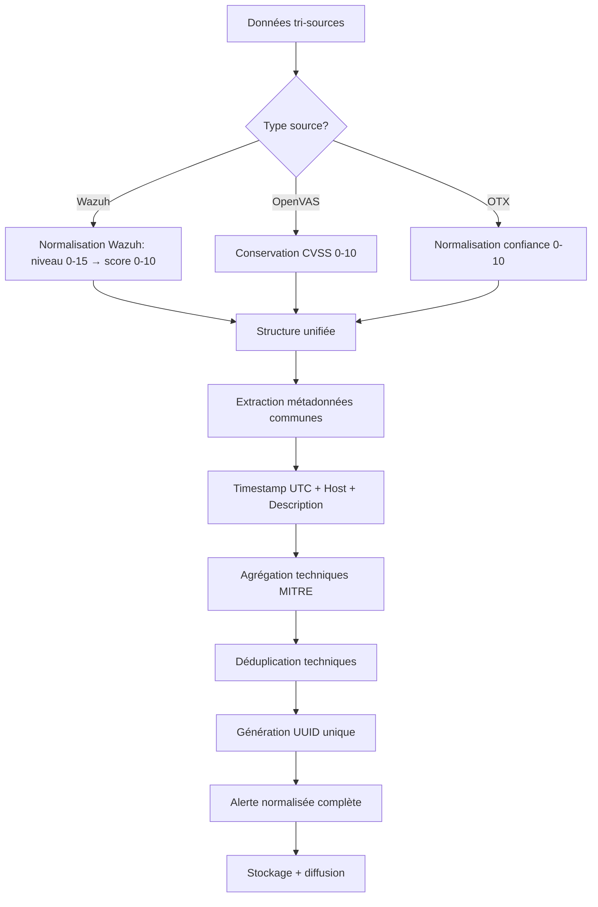
```mermaid
graph TD
    A[Données tri-sources] --> B{Type source?}
    B -->|Wazuh| C[Normalisation Wazuh: niveau 0-15 → score 0-10]
    B -->|OpenVAS| D[Conservation CVSS 0-10]
    B -->|OTX| E[Normalisation confiance 0-10]
    C --> F[Structure unifiée]
    D --> F
    E --> F
    F --> G[Extraction métadonnées communes]
    G --> H[Timestamp UTC + Host + Description]
    H --> I[Agrégation techniques MITRE]
    I --> J[Déduplication techniques]
    J --> K[Génération UUID unique]
    K --> L[Alerte normalisée complète]
    L --> M[Stockage + diffusion]
```

---

## 👥 Module 4 : Gestion des Utilisateurs {#module-gestion-utilisateurs}

### **Scénario 4.1 : Création Nouvel Utilisateur**

**Objectif :** Ajouter analyste avec accès immédiat selon rôle

**Description :**
Admin accède gestion users → formulaire création (email, nom, prénom, rôle) → validation unicité email → génération mot de passe temporaire sécurisé → création compte actif → envoi email automatique identifiants → changement obligatoire première connexion.

**Résultat Attendu :** Utilisateur opérationnel immédiatement avec sécurité renforcée

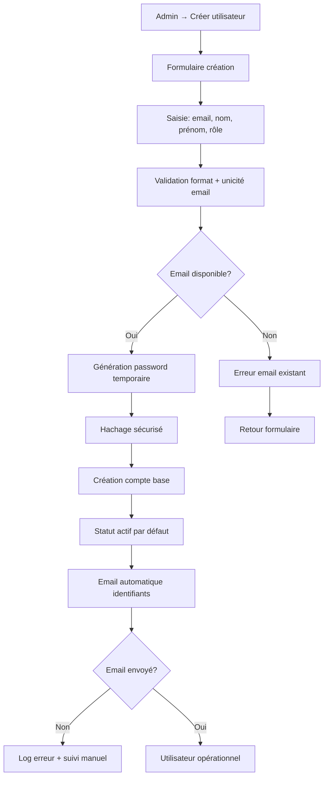
```mermaid
graph TD
    A[Admin → Créer utilisateur] --> B[Formulaire création]
    B --> C[Saisie: email, nom, prénom, rôle]
    C --> D[Validation format + unicité email]
    D --> E{Email disponible?}
    E -->|Non| F[Erreur email existant]
    E -->|Oui| G[Génération password temporaire]
    G --> H[Hachage sécurisé]
    H --> I[Création compte base]
    I --> J[Statut actif par défaut]
    J --> K[Email automatique identifiants]
    K --> L{Email envoyé?}
    L -->|Non| M[Log erreur + suivi manuel]
    L -->|Oui| N[Utilisateur opérationnel]
    F --> O[Retour formulaire]
```

### **Scénario 4.2 : Modification Permissions**

**Objectif :** Adapter droits selon évolution organisationnelle

**Description :**
Admin recherche utilisateur (filtres nom/email/rôle/statut) → modification formulaire pré-rempli → changements possibles: données perso, rôle, statut → notification changements permissions → application immédiate → email notification utilisateur.

**Résultat Attendu :** Gestion flexible droits avec application temps réel

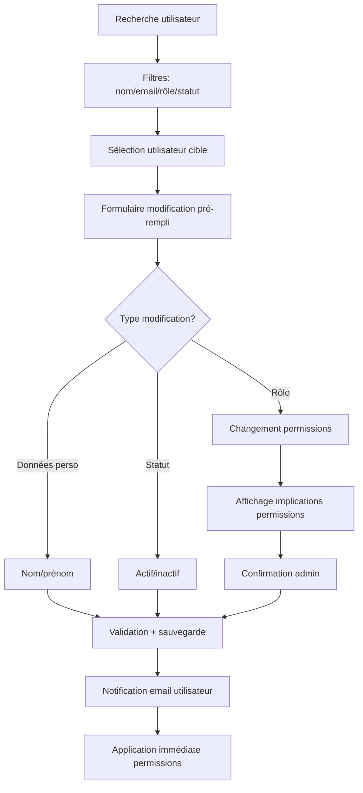
```mermaid
graph TD
    A[Recherche utilisateur] --> B[Filtres: nom/email/rôle/statut]
    B --> C[Sélection utilisateur cible]
    C --> D[Formulaire modification pré-rempli]
    D --> E{Type modification?}
    E -->|Données perso| F[Nom/prénom]
    E -->|Rôle| G[Changement permissions]
    E -->|Statut| H[Actif/inactif]
    F --> I[Validation + sauvegarde]
    G --> J[Affichage implications permissions]
    H --> I
    J --> K[Confirmation admin]
    K --> I
    I --> L[Notification email utilisateur]
    L --> M[Application immédiate permissions]
```

### **Scénario 4.3 : Désactivation/Archivage**

**Objectif :** Sécurisation immédiate départs avec traçabilité

**Description :**
Identification utilisateur → vérification alertes assignées → réassignation si nécessaire → choix désactivation temporaire/archivage définitif → préservation données audit → invalidation sessions → blocage accès immédiat.

**Résultat Attendu :** Sécurité immédiate avec conformité réglementaire

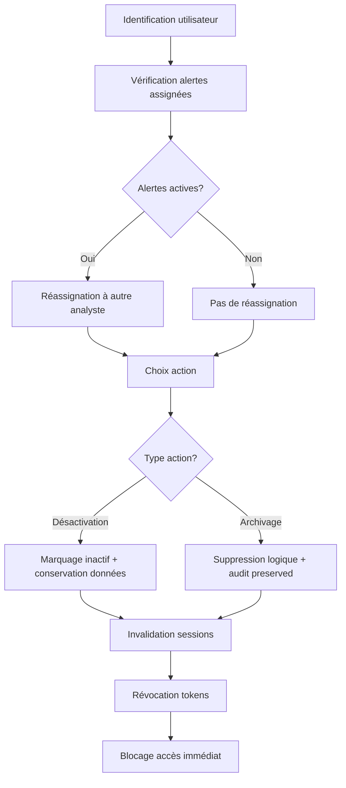
```mermaid
graph TD
    A[Identification utilisateur] --> B[Vérification alertes assignées]
    B --> C{Alertes actives?}
    C -->|Oui| D[Réassignation à autre analyste]
    C -->|Non| E[Pas de réassignation]
    D --> F[Choix action]
    E --> F
    F --> G{Type action?}
    G -->|Désactivation| H[Marquage inactif + conservation données]
    G -->|Archivage| I[Suppression logique + audit preserved]
    H --> J[Invalidation sessions]
    I --> J
    J --> K[Révocation tokens]
    K --> L[Blocage accès immédiat]
```

### **Scénario 4.4 : Consultation et Export**

**Objectif :** Audit et reporting accès système

**Description :**
Liste utilisateurs paginée 20/page → filtres multiples combinables → tri colonnes → export CSV avec métadonnées audit (qui, quand, filtres appliqués) → traçabilité complète.

**Résultat Attendu :** Vision claire accès + export audit conforme

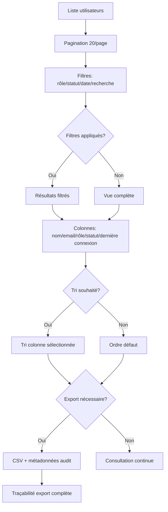
```mermaid
graph TD
    A[Liste utilisateurs] --> B[Pagination 20/page]
    B --> C[Filtres: rôle/statut/date/recherche]
    C --> D{Filtres appliqués?}
    D -->|Oui| E[Résultats filtrés]
    D -->|Non| F[Vue complète]
    E --> G[Colonnes: nom/email/rôle/statut/dernière connexion]
    F --> G
    G --> H{Tri souhaité?}
    H -->|Oui| I[Tri colonne sélectionnée]
    H -->|Non| J[Ordre défaut]
    I --> K{Export nécessaire?}
    J --> K
    K -->|Oui| L[CSV + métadonnées audit]
    K -->|Non| M[Consultation continue]
    L --> N[Traçabilité export complète]
```

---

## 🔍 Module 5 : Investigation Enrichie par IA (Modal RAG) {#module-investigation-rag}

### **Scénario 5.1 : Déclenchement Investigation Automatique**

**Objectif :** Investigation enrichie IA en un clic avec feedback progression

**Description :**
Analyste clic alerte dashboard → ouverture modal instantané → loader "Analyse IA en cours..." → récupération données brutes → normalisation STIX 2.1 → envoi Azure OpenAI → traitement arrière-plan automatique < 20 secondes.

**Résultat Attendu :** Investigation IA démarrée automatiquement sans intervention manuelle

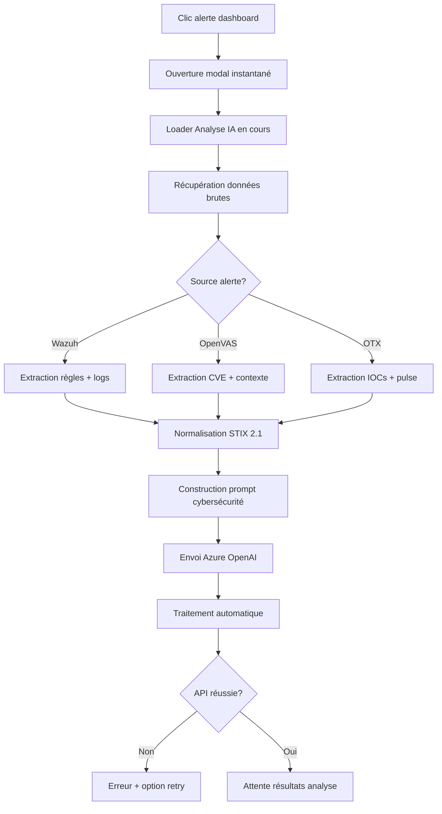
```mermaid
graph TD
    A[Clic alerte dashboard] --> B[Ouverture modal instantané]
    B --> C[Loader Analyse IA en cours]
    C --> D[Récupération données brutes]
    D --> E{Source alerte?}
    E -->|Wazuh| F[Extraction règles + logs]
    E -->|OpenVAS| G[Extraction CVE + contexte]
    E -->|OTX| H[Extraction IOCs + pulse]
    F --> I[Normalisation STIX 2.1]
    G --> I
    H --> I
    I --> J[Construction prompt cybersécurité]
    J --> K[Envoi Azure OpenAI]
    K --> L[Traitement automatique]
    L --> M{API réussie?}
    M -->|Non| N[Erreur + option retry]
    M -->|Oui| O[Attente résultats analyse]
```

### **Scénario 5.2 : Analyse RAG et Identification TTPs**

**Objectif :** Identification précise techniques MITRE avec raisonnement justifié

**Description :**
API RAG reçoit STIX 2.1 + contexte environnemental → prompt expert cybersécurité → Azure OpenAI analyse patterns → identification techniques MITRE → scores confiance 0.0-1.0 → raisonnement explicite → tactiques dérivées → format JSON structuré.

**Résultat Attendu :** TTPs identifiées avec justification traçable et scores confiance

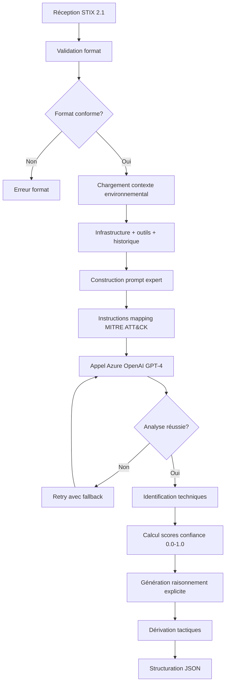
```mermaid
graph TD
    A[Réception STIX 2.1] --> B[Validation format]
    B --> C{Format conforme?}
    C -->|Non| D[Erreur format]
    C -->|Oui| E[Chargement contexte environnemental]
    E --> F[Infrastructure + outils + historique]
    F --> G[Construction prompt expert]
    G --> H[Instructions mapping MITRE ATT&CK]
    H --> I[Appel Azure OpenAI GPT-4]
    I --> J{Analyse réussie?}
    J -->|Non| K[Retry avec fallback]
    J -->|Oui| L[Identification techniques]
    L --> M[Calcul scores confiance 0.0-1.0]
    M --> N[Génération raisonnement explicite]
    N --> O[Dérivation tactiques]
    O --> P[Structuration JSON]
    K --> I
```

### **Scénario 5.3 : Génération Hunt Kestrel Automatique**

**Objectif :** Requête threat hunting contextuelle prête à l'exécution

**Description :**
TTPs identifiées → sélection template hunt spécialisé par technique → remplissage variables contextuelles (hosts, IOCs, timeframe) → optimisation environnement client → validation syntaxe → estimation ressources → formatage avec commentaires.

**Résultat Attendu :** Requête Kestrel optimisée avec coloration syntaxique et commentaires

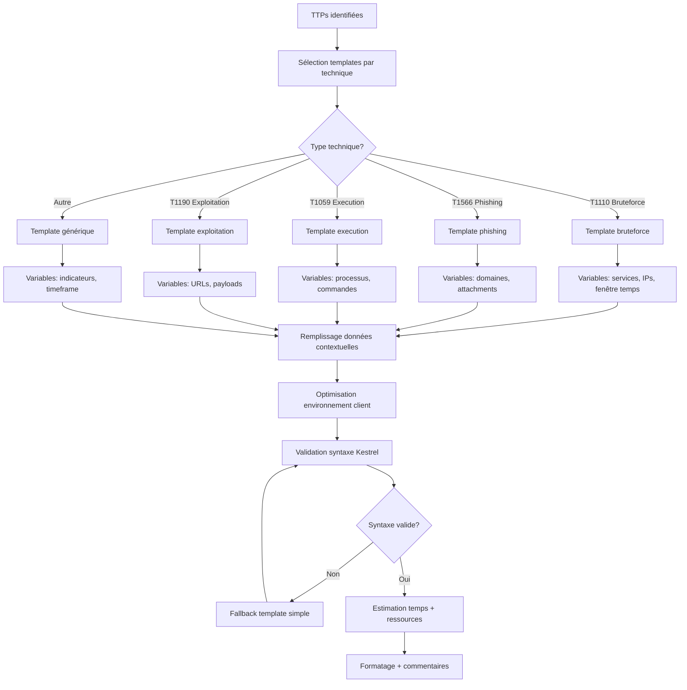
```mermaid
graph TD
    A[TTPs identifiées] --> B[Sélection templates par technique]
    B --> C{Type technique?}
    C -->|T1110 Bruteforce| D[Template bruteforce]
    C -->|T1566 Phishing| E[Template phishing]
    C -->|T1059 Execution| F[Template execution]
    C -->|T1190 Exploitation| G[Template exploitation]
    C -->|Autre| H[Template générique]
    D --> I[Variables: services, IPs, fenêtre temps]
    E --> J[Variables: domaines, attachments]
    F --> K[Variables: processus, commandes]
    G --> L[Variables: URLs, payloads]
    H --> M[Variables: indicateurs, timeframe]
    I --> N[Remplissage données contextuelles]
    J --> N
    K --> N
    L --> N
    M --> N
    N --> O[Optimisation environnement client]
    O --> P[Validation syntaxe Kestrel]
    P --> Q{Syntaxe valide?}
    Q -->|Non| R[Fallback template simple]
    Q -->|Oui| S[Estimation temps + ressources]
    S --> T[Formatage + commentaires]
    R --> P
```

### **Scénario 5.4 : Affichage Résultats Modal**

**Objectif :** Présentation claire résultats avec options action immédiate

**Description :**
Modal mise à jour automatique → section TTPs (cartes techniques + scores + raisonnement) → section Kestrel (requête formatée + coloration syntaxique) → boutons actions (Exécuter Hunt, Copier, Fermer) → métadonnées transparence (temps, version IA).

**Résultat Attendu :** Interface actionnable avec toutes informations nécessaires décision

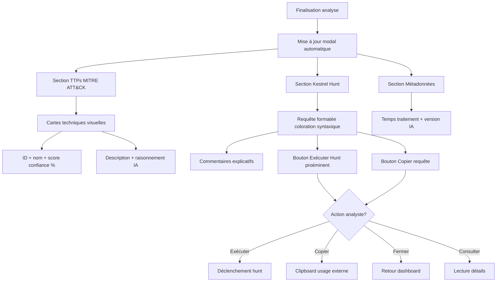
```mermaid
graph TD
    A[Finalisation analyse] --> B[Mise à jour modal automatique]
    B --> C[Section TTPs MITRE ATT&CK]
    B --> D[Section Kestrel Hunt]
    B --> E[Section Métadonnées]
    C --> F[Cartes techniques visuelles]
    F --> G[ID + nom + score confiance %]
    F --> H[Description + raisonnement IA]
    D --> I[Requête formatée coloration syntaxique]
    I --> J[Commentaires explicatifs]
    I --> K[Bouton Exécuter Hunt proéminent]
    I --> L[Bouton Copier requête]
    E --> M[Temps traitement + version IA]
    K --> N{Action analyste?}
    L --> N
    N -->|Exécuter| O[Déclenchement hunt]
    N -->|Copier| P[Clipboard usage externe]
    N -->|Fermer| Q[Retour dashboard]
    N -->|Consulter| R[Lecture détails]
```

### **Scénario 5.5 : Exécution Hunt et Résultats**

**Objectif :** Threat hunting efficace avec résultats exploitables

**Description :**
Clic "Exécuter Hunt" → validation requête → lancement moteur Kestrel → progression temps réel → recherche sources données parallèle → affichage résultats progressif → timeline chronologique finale → IOCs mis en évidence → recommandations actions.

**Résultat Attendu :** Découvertes exploitables pour réponse incident avec recommandations

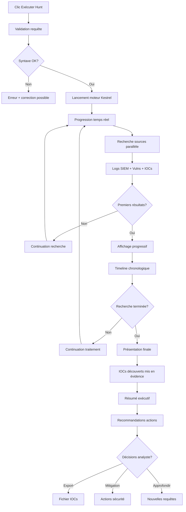
```mermaid
graph TD
    A[Clic Exécuter Hunt] --> B[Validation requête]
    B --> C{Syntaxe OK?}
    C -->|Non| D[Erreur + correction possible]
    C -->|Oui| E[Lancement moteur Kestrel]
    E --> F[Progression temps réel]
    F --> G[Recherche sources parallèle]
    G --> H[Logs SIEM + Vulns + IOCs]
    H --> I{Premiers résultats?}
    I -->|Non| J[Continuation recherche]
    I -->|Oui| K[Affichage progressif]
    K --> L[Timeline chronologique]
    L --> M{Recherche terminée?}
    M -->|Non| N[Continuation traitement]
    M -->|Oui| O[Présentation finale]
    O --> P[IOCs découverts mis en évidence]
    P --> Q[Résumé exécutif]
    Q --> R[Recommandations actions]
    R --> S{Décisions analyste?}
    S -->|Export| T[Fichier IOCs]
    S -->|Mitigation| U[Actions sécurité]
    S -->|Approfondir| V[Nouvelles requêtes]
    J --> F
    N --> F
```

---

## 🔄 Fonctionnalités Transversales {#fonctionnalites-transversales}

### **Scénario 6.1 : Gestion Sessions et Sécurité**

**Objectif :** Sécurité robuste accès avec traçabilité complète

**Description :**
Sessions limitées 8h avec tracking inactivité → avertissement 30min, déconnexion auto 60min → détection connexions multiples → actions sensibles nécessitent reconfirmation → logs audit complets → blocage tentatives non autorisées.

**Résultat Attendu :** Protection contre usages malveillants avec audit complet

```mermaid
graph TD
    A[Session utilisateur active] --> B[Tracking activité continue]
    B --> C{Durée session?}
    C -->|< 8h| D[Session valide]
    C -->|≥ 8h| E[Expiration forcée]
    D --> F[Surveillance inactivité]
    F --> G{Temps inactivité?}
    G -->|< 30min| H[Utilisateur actif]
    G -->|30-60min| I[Avertissement déconnexion]
    G -->|> 60min| J[Déconnexion auto]
    H --> K[Détection connexions multiples]
    I --> L{Utilisateur répond?}
    L -->|Oui| M[Reset timer]
    L -->|Non| J
    J --> N[Invalidation token]
    E --> N
    K --> O{Connexions simultanées?}
    O -->|Oui| P[Alerte sécurité]
    O -->|Non| Q[Actions sensibles monitoring]
    Q --> R{Action sensible?}
    R -->|Oui| S[Reconfirmation password]
    R -->|Non| T[Action autorisée]
    S --> U{Reconf OK?}
    U -->|Oui| T
    U -->|Non| V[Action refusée]
    T --> W[Log audit action]
    V --> W
    M --> H
```

### **Scénario 6.2 : Performance et Montée en Charge**

**Objectif :** Expérience fluide même en charge élevée avec auto-scaling

**Description :**
Support 20+ utilisateurs simultanés → monitoring continu métriques → dashboard < 2s même avec 1000+ alertes → optimisations automatiques (cache Redis, load balancing) → queue analyses RAG en cas de pic → alertes si seuils dépassés.

**Résultat Attendu :** Performance maintenue avec optimisations automatiques

```mermaid
graph TD
    A[Monitoring charge continue] --> B{Nb utilisateurs?}
    B -->|≤ 20| C[Charge normale]
    B -->|> 20| D[Charge élevée]
    C --> E[Performance optimale]
    D --> F[Optimisations auto]
    F --> G[Scaling + load balancing]
    G --> H[Cache Redis optimisé]
    E --> I[Monitoring dashboard]
    H --> I
    I --> J{Temps chargement?}
    J -->|< 2s| K[Performance OK]
    J -->|≥ 2s| L[Dégradation détectée]
    L --> M[Diagnostic automatique]
    M --> N{Type problème?}
    N -->|Base données| O[Optimisation requêtes]
    N -->|Cache| P[Refresh cache]
    N -->|Réseau| Q[Optimisation WebSocket]
    O --> R[Index BDD vérifiés]
    P --> S[Cache warming]
    Q --> T[Connexions optimisées]
    K --> U[Monitoring API RAG]
    R --> U
    S --> U
    T --> U
    U --> V{Performance Azure OpenAI?}
    V -->|OK| W[Débit normal]
    V -->|Lente| X[Queue analyses]
    X --> Y[Priorisation requêtes]
    Y --> Z[Traitement séquentiel]
    W --> AA[Métriques continues]
    Z --> AA
```

### **Scénario 6.3 : Sauvegarde et Continuité Service**

**Objectif :** Continuité service avec protection données critiques

**Description :**
Sauvegardes quotidiennes heures creuses → chiffrement AES-256 → stockage externe sécurisé → plan continuité RTO < 4h, RPO < 1h → basculement automatique si incident → tests restauration mensuels.

**Résultat Attendu :** Recovery garanti avec conformité réglementaire

```mermaid
graph TD
    A[Sauvegarde quotidienne] --> B[Vérification heures creuses 2h-4h]
    B --> C{Période appropriée?}
    C -->|Non| D[Attente créneau]
    C -->|Oui| E[Démarrage sauvegarde]
    E --> F[Données critiques identifiées]
    F --> G[Users + Alertes + Config + Logs]
    G --> H[Chiffrement AES-256]
    H --> I[Upload stockage externe]
    I --> J{Upload réussi?}
    J -->|Non| K[Retry sauvegarde]
    J -->|Oui| L[Vérification intégrité]
    L --> M{Intégrité OK?}
    M -->|Non| N[Nouvelle sauvegarde]
    M -->|Oui| O[Backup validé]
    O --> P[Surveillance incidents]
    P --> Q{Incident critique?}
    Q -->|Non| R[Fonctionnement normal]
    Q -->|Oui| S[Activation continuité]
    S --> T[Basculement environnement secours]
    T --> U[Restauration RTO < 4h]
    U --> V{Restauration OK?}
    V -->|Non| W[Escalade équipe]
    V -->|Oui| X[Service restauré RPO < 1h]
    K --> E
    N --> E
    D --> B
```

---

## 📊 Critères de Validation {#criteres-validation}

### **Matrice Traçabilité Exigences → Tests**

| Exigence Fonctionnelle | Scénario Test | Responsable |
|------------------------|---------------|-------------|----------------|
| **Auth sécurisée** | Login + rôles + anti-bruteforce | Admin Système |
| **Dashboard temps réel** | Chargement + WebSocket + pagination | Analyst Senior |
| **Sources CTI** | Sync Wazuh/OpenVAS/OTX + mapping | Expert CTI |
| **Gestion users** | CRUD + permissions + notifications | Admin Système |
| **Investigation RAG** | Modal + Azure OpenAI + Kestrel | Analyst Expert |
| **Performance** | Charge 20+ users + APIs | Référent Technique |

### **Tests Acceptation par Rôle**

#### **Tests Admin Système**
- ✅ Authentification : Tous scénarios connexion/échec/rôles
- ✅ Gestion Users : CRUD complet + permissions + notifications
- ✅ Configuration : Sources CTI + paramètres système
- ✅ Monitoring : Performance + sécurité + logs audit

#### **Tests Analyst SOC**
- ✅ Dashboard : Chargement + temps réel + navigation historique
- ✅ Investigation : Modal + RAG + TTPs + Kestrel hunt
- ✅ Workflow : Alerte → Investigation → Hunt → Actions
- ✅ Performance : Fluidité usage quotidien

#### **Tests Manager SOC**
- ✅ Métriques : Statistiques + tendances + drill-down
- ✅ Reporting : Export + audit + conformité
- ✅ Vision globale : Dashboard exécutif + KPIs
- ✅ ROI : Efficacité équipe + réduction temps